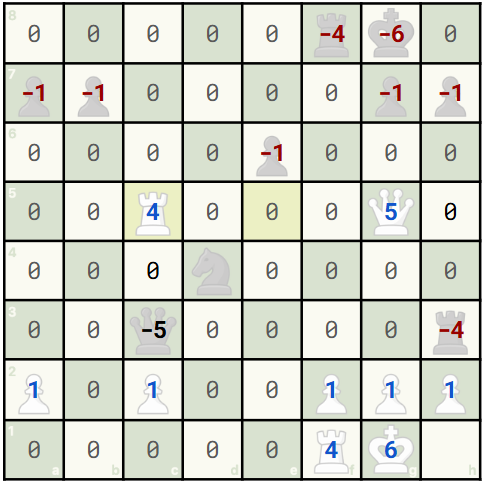

# Designing the board tensor

In order for my model to learn to play good chess, I must give it a **representation of a board** as an input. Since chess is played on an 8x8 board, why not just represent my board as an 8x8 array?

The problem is that the board consists of different pieces (pawns, bishops, knights, rooks, queen, king). How should I tell my model about these pieces?

Since there are 6 pieces, I could pick 1 for pawn, 2 for bishop, 3 for knight, 4 for rook, 5 for queen, 6 for king. And I could make this negative for the black pieces. 0 could mean there are no pieces there.

Consider this position from Levitsky-Marshall (1912):

")

If we were to encode it with the above logic, we'd get an 8x8 matrix that looks like this:



## Why doesn't this work?
* **Encoding pieces with integers** implies some importance to the number. We'd be telling the CNN a pawn (1 or -1) is closer to an "empty piece" (0) than a queen is. Even worse, a white pawn is closer to a black pawn (distance of 2) than a white pawn is to a white king. So we want to avoid encoding pieces with arbitrary numbers that give confused meaning to the network.
* **We don't know important game state details.** We don't know whose turn it is to play because it's not encoded in the 8x8 matrix. In this position, clearly Black and White have both castled, but the board needs to know if castling is on the table. Similarly, we need to encode en-passant rules.

Since we'll pass a tensor into our CNN, we can have **multiple channels**. Consider this design that overcomes the above problems. We have **25 channels** (I'll also refer to these as planes sometimes) that are each 8x8 arrays (so the tensor shape is `[25, 8, 8]`):
* **Each piece is represented on a different channel**. As seen in the snippet below, `tensor[0:12]` represent the position of a single piece. We use one-hot encoding, so the value is 1 if the piece is on that square, 0 otherwise.
```python
_PIECE_PLANES = {
    (chess.PAWN, chess.WHITE): 0,
    (chess.KNIGHT, chess.WHITE): 1,
    (chess.BISHOP, chess.WHITE): 2,
    (chess.ROOK, chess.WHITE): 3,
    (chess.QUEEN, chess.WHITE): 4,
    (chess.KING, chess.WHITE): 5,
    (chess.PAWN, chess.BLACK): 6,
    (chess.KNIGHT, chess.BLACK): 7,
    (chess.BISHOP, chess.BLACK): 8,
    (chess.ROOK, chess.BLACK): 9,
    (chess.QUEEN, chess.BLACK): 10,
    (chess.KING, chess.BLACK): 11
}

# later...

    # Create the 12 position planes
    for square, piece in board.piece_map().items():
        # look up the plane
        plane = _PIECE_PLANES[(piece.piece_type, piece.color)]
        row, col =  get_rc_from_square(square)
        res[plane, row, col] = 1.0
```
* **`tensor[12]` tells us whose turn it is.** It is an 8x8 array that is 1 if it's White's turns and 0 if it's Black.
* **`tensor[13:17]` consists of castling rights.** So if white has kingside castling rights, the entire 8x8 channel is 1, else it's 0. These 4 channels are 8x8 arrays that are either all 0s or 1s. 
```python
    # set the castling planes
    if board.has_kingside_castling_rights(chess.WHITE):
        res[13, :, :] = 1.0
    if board.has_queenside_castling_rights(chess.WHITE):
        res[14, :, :] = 1.0
    if board.has_kingside_castling_rights(chess.BLACK):
        res[15, :, :] = 1.0
    if board.has_queenside_castling_rights(chess.BLACK):
        res[16, :, :] = 1.0
```
* **`tensor[17:25]` contains en-passant rules** Similar to above, these 8 channels represent each of the 8 files and tells us whether that file has an en-passant move available.
```python
    # en passant planes
    # only one file can be true at once
    if board.ep_square is not None:
        ep_file = chess.square_file(board.ep_square)
        res[17+ep_file, :, :] = 1.0
```
## Visualizing our final tensor design
So how does the Levitsky-Marshall move look?
 Tensor")

We've successfully encoded all the details of the game state (position info, turn info, castling, en-passant). The **downside** of this approach is we are using a lot of space to represent turn info and other rules. In these cases, we are making the entire matrix of 64 numbers either 1 or 0 instead of representing it as a single bit.

This redundancy increases memory usage and slightly slows down training, but it makes the data **spatially uniform**. This means every piece of information, whether local or global, lives in an 8×8 array. That consistency simplifies the model design, since a convolutional network can process all planes in the same way without needing special handling for scalar features.

I'm using this tensor design to encode games in preparation of passing it through a CNN. In the next article, I plan to cover decisions around selecting training data and a more concrete CNN design.