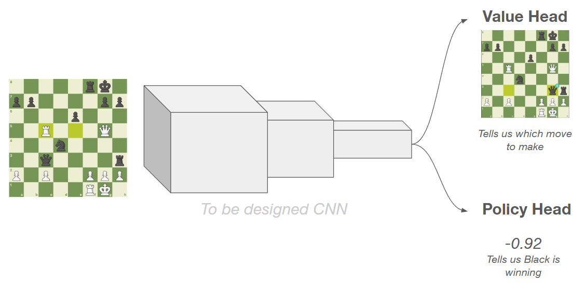

# Teaching machines chess from first principles

I'm ~1800–1900 in Lichess Rapid, and like many serious hobbyists, I've spent a lot of time thinking about how chess *works*. Tactics are teachable, but to me, **strategy and pressure have always felt vibey**. But because the top engines are stronger than any human, I've always wondered:

  <blockquote>
    
<em>Are engines strong because <b>they calculate tactics</b> well...</em>

    
<em>... or because <b>they've learned strategy</b>?</em>

  </blockquote>

**I'm building an AlphaZero-style chess engine** from scratch: *a system that learns chess without being told what "good" chess looks like.*

## There are two philosophies to train a chess engine

1. **Teach the engine "good" chess.**  
   We provide heuristics that encode our opinions of what strong play looks like. This is how Deep Blue beat Kasparov, and how earlier versions of Stockfish and Houdini worked.
   <label for="mn-1" class="margin-toggle">⊕</label>
   <input type="checkbox" id="mn-1" class="margin-toggle"/>
   
     In Approach 1, the machine never discovers chess; it just applies human ideas faster than humans can.
   

   Some heuristics we can encode:
   - Rewarding material (Queen > Rook > Bishop ≈ Knight > Pawn)
   - Control of the center (e.g. "A knight on the rim is dim.")
   - King safety
   - Different priorities across opening, middlegame, endgame

2. **Let the machine discover chess for itself.**  
   Just tell the machine the rules of the game and nothing else (no human guidance of what "good" chess is). The machine has to learn chess from first principles. AlphaZero and Leela are trained in this way.

It always felt mystical to me that a machine could see enough games and learn chess better than I've learned it through focused study, and I want to replicate that.

This is the first in a series of engineering notes. The goal isn't to show just the result, but to walk through reasoning behind decisions like:

- Choosing a representation for the board and pieces
- Selecting a model
- Building a search and evaluation function
- Other decisions I don't know I have to make yet!

I intend the last note to be a look inside the layers of the final model, answering:

  <blockquote>
    <b>What does a machine actually learn about chess when we give it no human guidance?</b>
  </blockquote>

## High-level architecture and plan
I'm picking some default decisions based on my initial review of the existing literature (although I will  likely change many of these decisions as I proceed with the project). Before I draw any diagrams, let me lay out my anticipated steps:

   <label for="mn-2" class="margin-toggle">⊕</label>
   <input type="checkbox" id="mn-1" class="margin-toggle"/>
   
   A legendary moment from Levitsky-Marshall (1912). The model should ideally predict this position is winning for Black and find the stunning move Marshall found. As an aside, Marshall is one of my favorite players and the Marshall Attack is my go-to when faced with a Ruy Lopez as black.
   

1. **Train a baseline model off high-quality games.** My baseline model will be trained on a convolutional neural net (CNN), similar to how image classification models are trained. I'll write an article later about my rationale why. The **input** to the model is a **board tensor** that I'll write about designing in the next article. The model will have two heads:
    1. A **Value Head** will predict the expected outcome of the game based on the current position and will output a number in $[-1, 1]$. A value close to -1 indicates Black is winning, a value close to 1 indicates White is winning, and a value close to 0 indicates a drawish position.
    2. A **Policy Head** will predict the next move. It will be a probability distribution over all moves. Illegal moves should have a probability of zero and the stronger the move (according to the model), the closer to 1 that move's output will be. One interesting question to consider is: What is the shape of the policy head and why? I'm considering a few options.
2. **Make my baseline model playable.** This will involve creating a Search function. The two choices here are (1) Monte Carlo Search Tree (2) Minmax with Alpha Beta Pruning. I don't know enough about the tradeoffs to have a prior opinion on my approach. This is something I'll learn as I proceed through the project.
3. **Improve the model through Reinforcement Learning self-play.** Today, I know very little about reinforcement learning
4. **Look inside the neural net and mine the model's secrets.** Hopefully, I can serve the model so you can play with it and peek inside as well. I'm curious to see if the different layers of the net will look for open files, pins, forks, etc. in the same way that humans do.

   <label for="mn-3" class="margin-toggle">⊕</label>
   <input type="checkbox" id="mn-1" class="margin-toggle"/>
   
   Some important literature that helped me get started: <a href="https://www.science.org/doi/10.1126/science.aar6404" target="_blank">
        Silver et al. (2018), *A general reinforcement learning algorithm that masters chess, shogi, and Go through self-play*
    </a>, <a href="https://www.nature.com/articles/s41586-020-03051-4">Schrittwieser et al. (2020), *Mastering Atari, Go, chess and shogi by planning with a learned model*</a>, and <a href="https://lczero.org/dev/old/nn/">LeelaZero dev docs</a>.
   